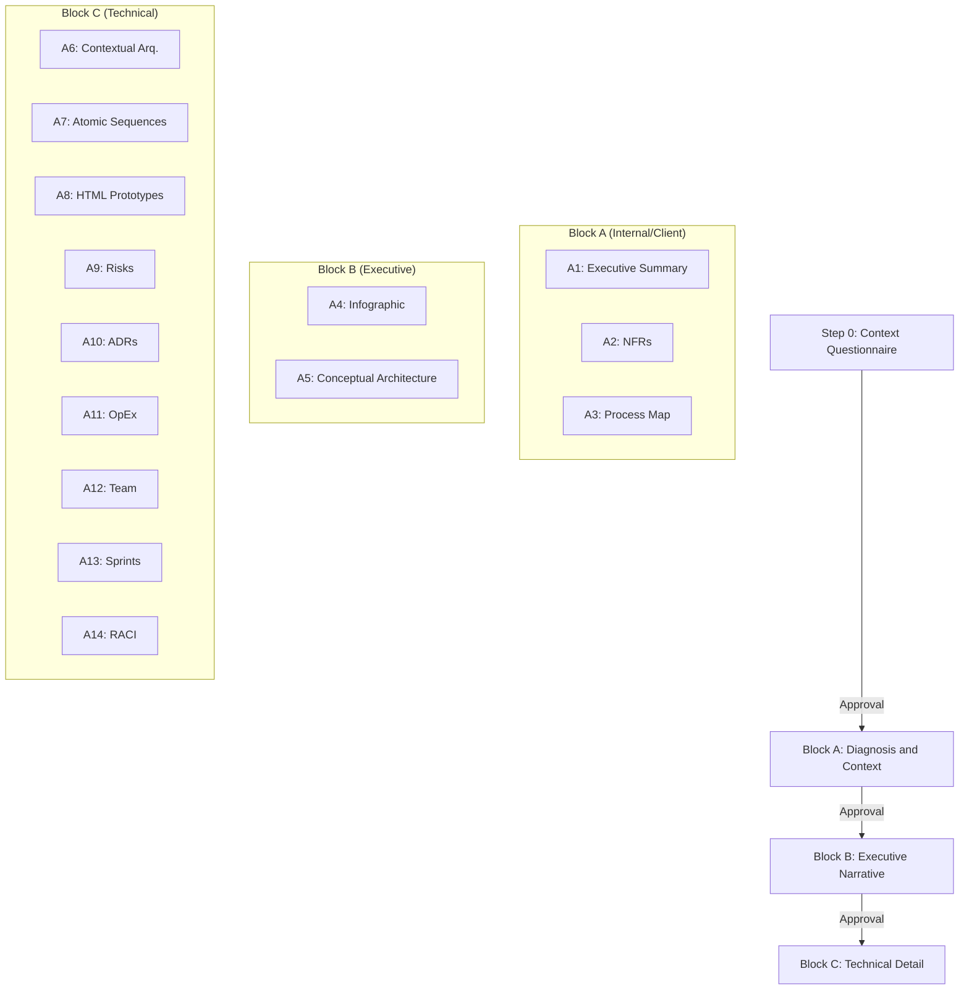
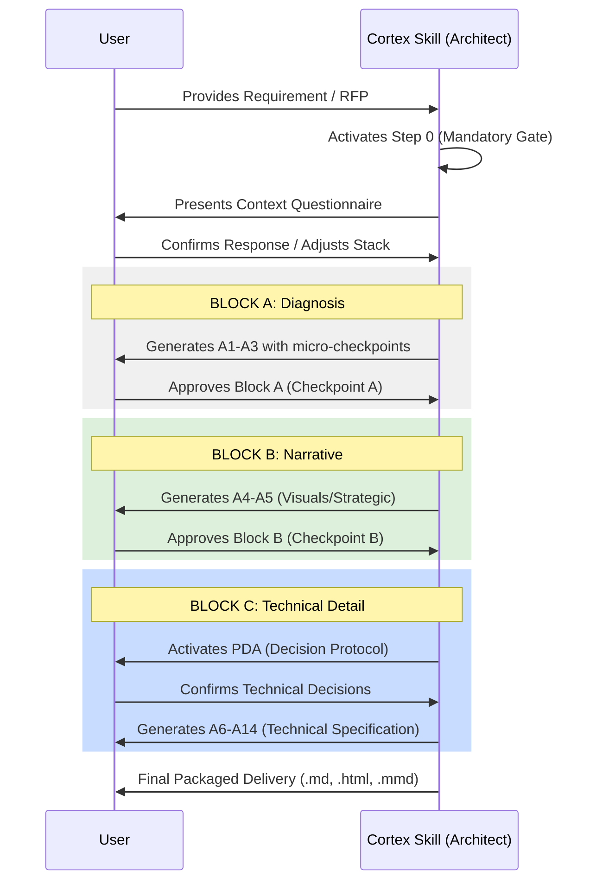
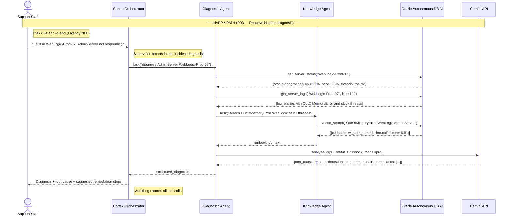
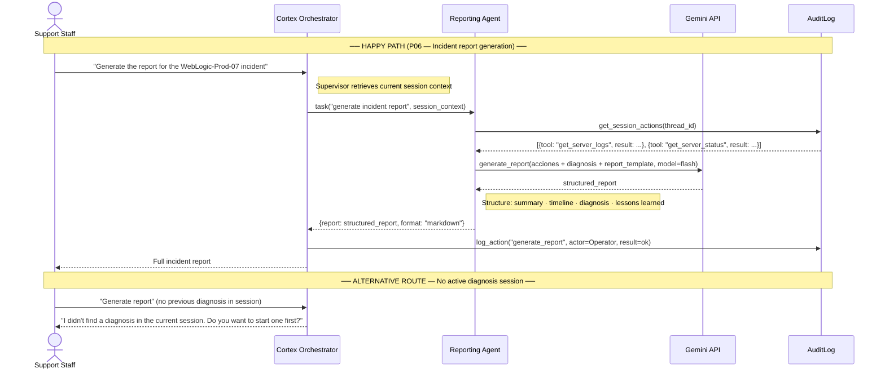

# Cortex Skill: Architectural Analysis

This skill generates a complete functional and architectural analysis for client proposals from a requirement document or conversation. It is designed to transform business needs into high-quality technical and executive artifacts, following a strict sequential flow. It has been tested with claude.ai / claudde code. The generation of artifacts such as HTML infographics will depend on the capabilities of each agent.

[Spanish version available here](README_es.md)

## Project Structure

```text
.
├── .gitignore                          # Configuration for ignored files
├── README.md                           # Main project documentation (English)
├── README_es.md                        # Project documentation (Spanish)
└── cortex-skill-architectural-analysis/ # Skill root directory
    ├── SKILL.md                        # Skill definition and logic
    └── references/                     # Templates and reference guides
```

## Skill Architecture

### Conceptual Architecture

The skill operates under a **sequential blocks** model with approval gates (*gates*). Each block generates a set of artifacts that serve as input for the next one.



### Operation Sequence Diagram

The interaction flow between the user and the skill ensures there is no over-engineering and that artifacts are consistent.



## Main Features

- **Context Propagation**: The technological stack and component names defined initially remain identical across all artifacts.
- **Architectural Decision Protocol (PDA)**: Before defining technical architecture, compute, data, and integration trade-offs are consulted.
- **Sequence Atomicity**: Sequence diagrams are divided into minimum verifiable flows.
- **Derived Prototyping**: UI screens are generated directly from the steps of the sequence diagrams.

## Skill Usage

To activate the skill, simply load a requirements document or describe your system. The skill will respond by starting **Step 0** to capture the base technological context (Cloud, Backend, Frontend, etc.).

> **Important**: No artifacts will be generated until Step 0 is explicitly confirmed.

## Design Guide (Design System)

All generated HTML artifacts follow a premium design system, with clear palettes and modern typography, ensuring a professional presentation for the final client. Refer to `references/design-system.md` for more details.

## Artifact Examples

Below are examples of some of the artifacts that this skill is capable of generating as part of an architectural analysis of a requirement.

### 1. Conceptual Architecture
This diagram shows the interaction of the system with external actors and internal layers.


### 1.2 Contextual Architecture
This diagram shows the relationships between the components of the system.


### 2. Problem and Solution Infographic
Executive visualization of client challenges and the value proposition.


### 3. Atomic Sequence Diagrams
Examples of detailed flows for diagnosis and reporting.

#### Reactive Diagnosis Detail


#### Report Generation


### 4. UI Prototypes
Example of generated interfaces for the system.


