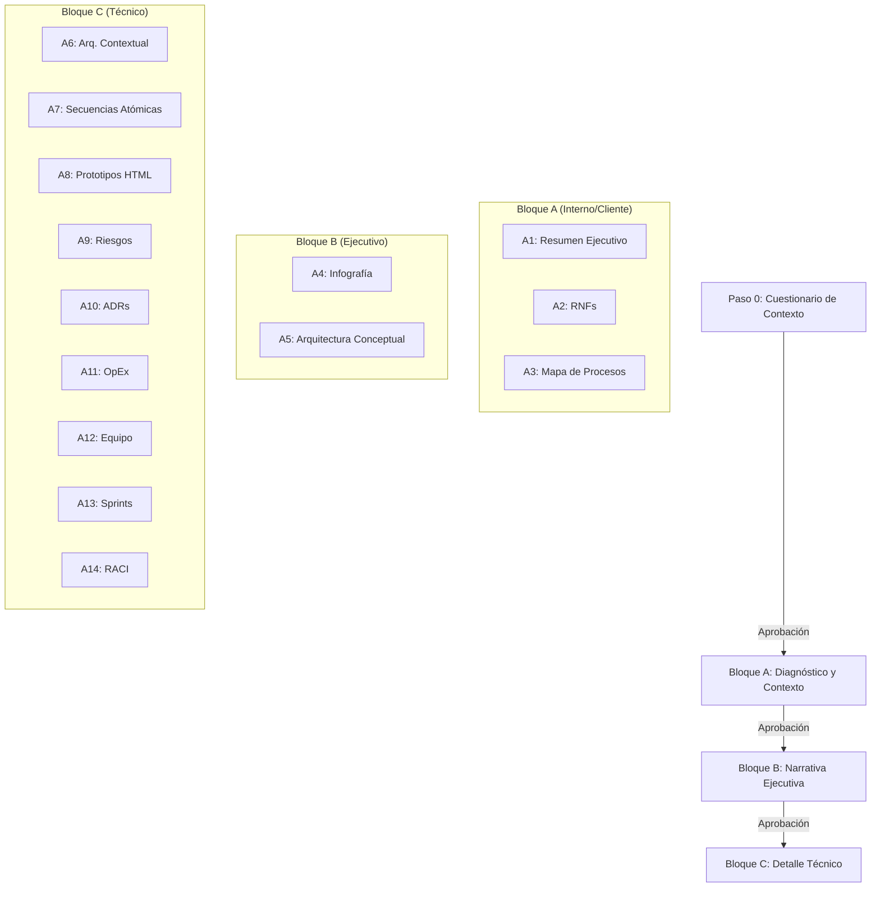
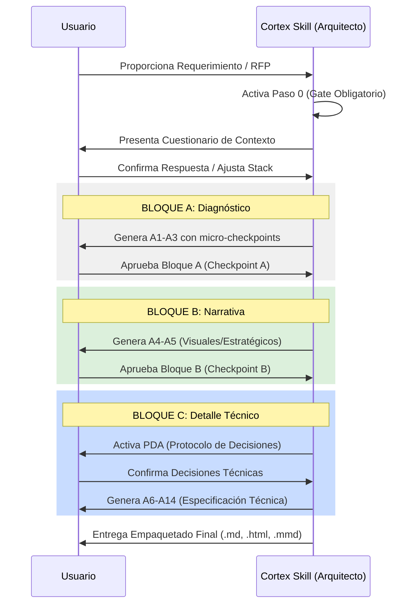
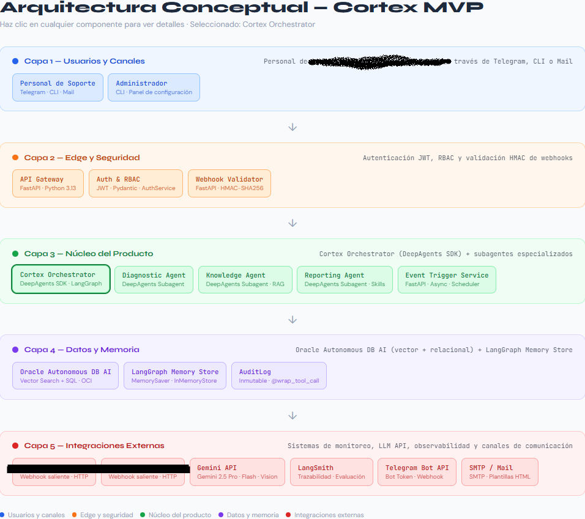
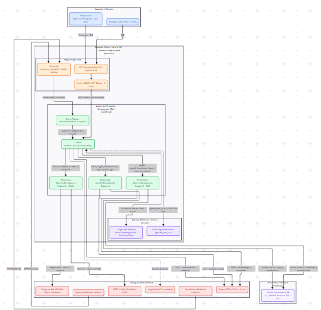
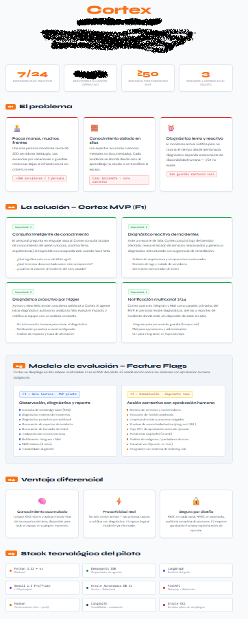
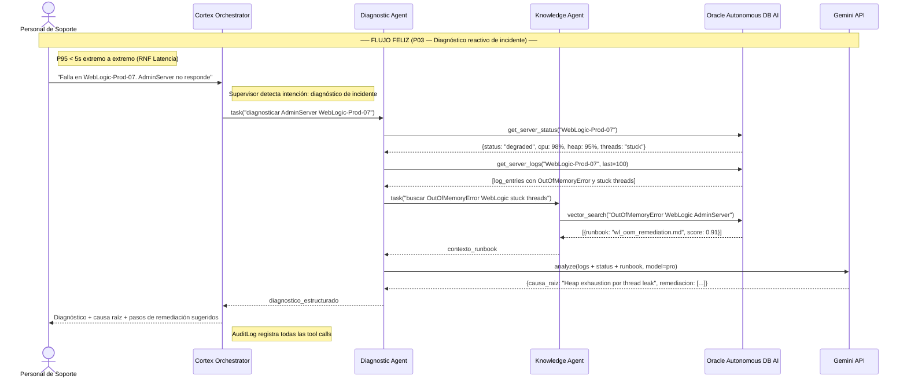
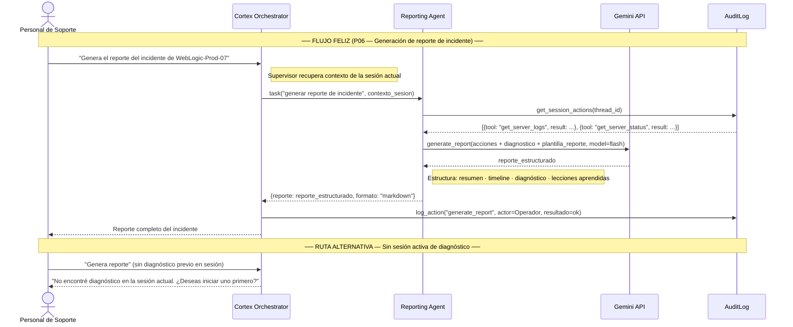
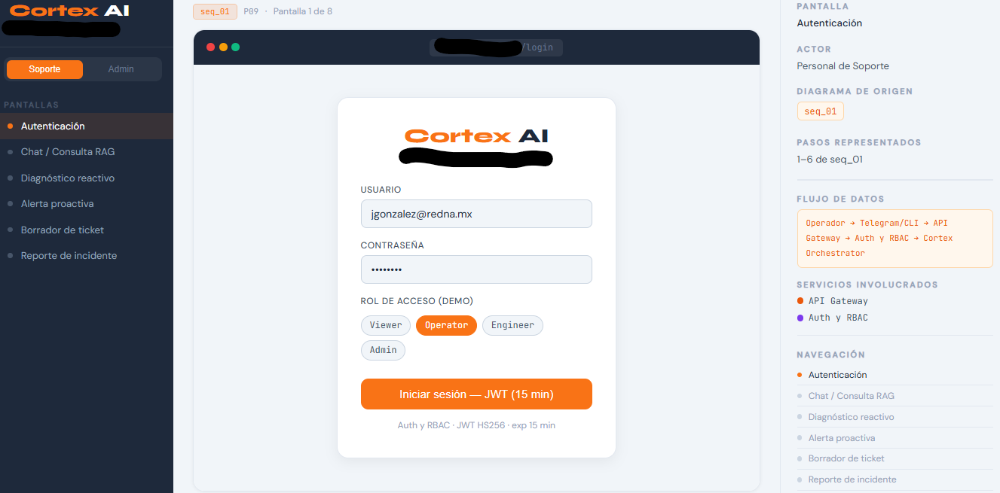

# Cortex Skill: Architectural Analysis

[Versión en Inglés disponible aquí](README.md)

Este skill genera un análisis funcional y arquitectónico completo para propuestas a clientes a partir de un documento de requerimientos o conversación. Está diseñado para transformar necesidades de negocio en artefactos técnicos y ejecutivos de alta calidad, siguiendo un flujo secuencial estricto. A sido probado con claude.ia / claudde code . Dependerá de las capcidades de cada agente la generación de artefactos como las infografías en HTML

## Estructura del Proyecto

```text
.
├── .gitignore                          # Configuración de archivos ignorados
├── README.md                           # Documentación principal del proyecto (Inglés)
├── README_es.md                        # Documentación del proyecto (Español)
└── cortex-skill-architectural-analysis/ # Directorio raíz del skill
    ├── SKILL.md                        # Definición y lógica del skill
    └── references/                     # Plantillas y guías de referencia
```

## Arquitectura del Skill

### Arquitectura Conceptual

El skill opera bajo un modelo de **bloques secuenciales** con compuertas de aprobación (*gates*). Cada bloque genera un conjunto de artefactos que sirven de insumo para el siguiente.



### Diagrama de Secuencia de Operación

El flujo de interacción entre el usuario y el skill garantiza que no haya sobreingeniería y que los artefactos sean consistentes.



## Características Principales

- **Propagación de Contexto**: El stack tecnológico y los nombres de componentes definidos inicialmente se mantienen idénticos en todos los artefactos.
- **Protocolo de Decisiones Arquitectónicas (PDA)**: Antes de definir arquitectura técnica, se consultan trade-offs de cómputo, datos e integración.
- **Atomicidad en Secuencias**: Los diagramas de secuencia se dividen en flujos mínimos verificables.
- **Prototipado Derivado**: Las pantallas de UI se generan directamente de los pasos de los diagramas de secuencia.

## Uso del Skill

Para activar el skill, simplemente carga un documento de requerimientos o describe tu sistema. El skill responderá iniciando el **Paso 0** para capturar el contexto tecnológico base (Nube, Backend, Frontend, etc.).

> **Importante**: No se avanzará a la generación de artefactos hasta que el Paso 0 sea confirmado explícitamente.

## Guía de Diseño (Design System)

Todos los artefactos HTML generados siguen un sistema de diseño premium, con paletas claras y tipografía moderna, asegurando una presentación profesional para el cliente final. Reportarse a `references/design-system.md` para más detalles.

## Ejemplos de Artefactos

A continuación se presentan ejemplos de algunos de los artefactos que este skill es capaz de generar como parte de un análisis arquitectónico de un requerimiento.

### 1. Arquitectura Conceptual
Este diagrama muestra la interacción del sistema con actores externos y capas internas.



### 1.2 Arquitectura Contextual
Este diagrama muestra la relación entre los componentes del sistema.



### 2. Infografía de Problema y Solución
Visualización ejecutiva de los desafíos del cliente y la propuesta de valor.



### 3. Diagramas de Secuencia Atómicos
Ejemplos de flujos detallados para diagnóstico y reporteo.

#### Detalle de Diagnóstico Reactivo


#### Generación de Reportes


### 4. Prototipos de Pantallas
Ejemplo de interfaces generadas para el sistema.



## Autor

- **Autor**: Alejandro Sánchez C.
- **Contacto**: [alejandro.sanchez.caceres@gmail.com](mailto:alejandro.sanchez.caceres@gmail.com) / [Linktr.ee](https://linktr.ee/alejandro.sanchez.caceres)
