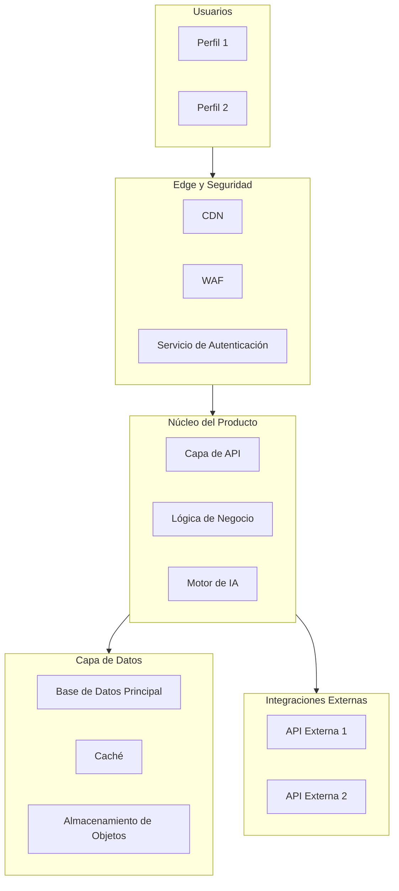

# Detalle del Flujo de Trabajo

Plantillas y guías detalladas para cada artefacto.
Carga este archivo cuando el usuario solicite detalles específicos de generación de artefactos.

---

## Artefacto 1 — Plantilla de Resumen Ejecutivo

```markdown
# Resumen Ejecutivo — [Nombre del Proyecto]

## Problema Identificado
[2-3 párrafos que describan el problema de negocio, no la solución técnica]

## Propuesta de Valor
[Qué resuelve la solución y qué beneficios concretos aporta al cliente]

## Alcance del MVP
### Dentro del alcance
- [Capacidad o funcionalidad 1]
- [Capacidad o funcionalidad 2]

### Fuera del alcance (MVP)
- [Elemento explícitamente excluido 1]
- [Elemento explícitamente excluido 2]

## Supuestos Clave
- [Supuesto 1]
- [Supuesto 2]

## Preguntas y Dudas para el Cliente
| ID | Pregunta | Impacto si no se aclara |
|----|----------|------------------------|
| P1 | ...      | ...                    |
```

---

## Artefacto 6 — Plantilla Mermaid para Arquitectura Contextual



Adapta los nombres de los servicios al cloud y stack definidos en el Paso 0.
Máximo 3 niveles de anidamiento. Serverless-first para cargas de trabajo variables.

---

## Artefacto 7 — Plantilla de Diagrama de Secuencia

```
sequenceDiagram
  actor Usuario
  participant FE as Frontend
  participant APIGW as API Gateway
  participant SVC as [Nombre del Servicio]
  participant BD as Base de Datos
  participant EXT as Servicio Externo

  Note over Usuario,EXT: ── FLUJO FELIZ ──

  Usuario->>FE: [Acción del usuario]
  FE->>APIGW: [Método HTTP] /[endpoint] {payload}
  APIGW->>SVC: invoke({parámetros})

  alt Ruta exitosa
    SVC->>BD: [Operación de lectura/escritura]
    BD-->>SVC: [Respuesta]
    SVC-->>APIGW: {resultado}
    APIGW-->>FE: 200 OK
    FE-->>Usuario: [Confirmación al usuario]
  else Ruta de error
    SVC-->>APIGW: [Código de error]
    APIGW-->>FE: [Estado de error]
    FE-->>Usuario: [Mensaje de error]
  end
```

---

## Artefacto 9 — Plantilla de Registro de Riesgos

```markdown
## Registro de Riesgos — [Nombre del Proyecto]

| ID  | Riesgo | Categoría | Probabilidad | Impacto | Mitigación Sugerida |
|-----|--------|-----------|--------------|---------|---------------------|
| R01 | Dependencia de API externa sin SLA garantizado | Técnico | Media | Alto | Circuit breaker + caché local |
| R02 | ... | ... | ... | ... | ... |

Categorías: Técnico / Negocio / Regulatorio / Operativo / Equipo
Probabilidad: Alta / Media / Baja
Impacto: Alto / Medio / Bajo
```

---

## Artefacto 10 — Plantilla de ADR

```markdown
## ADR-001 — [Título de la Decisión]

**Fecha:** [Fecha de generación]
**Estado:** Propuesto / Aceptado / Obsoleto

### Contexto
[Por qué fue necesario tomar esta decisión]

### Decisión
[Qué se decidió]

### Alternativas Consideradas
| Alternativa | Ventaja | Desventaja |
|-------------|---------|------------|
| Opción A    | ...     | ...        |
| Opción B    | ...     | ...        |

### Consecuencias
[Qué implica esta decisión a futuro: deuda técnica, restricciones, oportunidades]
```

---

## Artefacto 11 — Plantilla de Estimación de Costos OpEx

```markdown
## Estimación de Costos Operativos — [Nombre del Proyecto]

| Componente | MVP | Escala 1 (10x) | Escala 2 (100x) | Notas |
|------------|-----|----------------|-----------------|-------|
| Cómputo (Lambda/Contenedor) | $X/mes | $Y/mes | $Z/mes | Pago por uso |
| Base de datos | $X/mes | ... | ... | Bajo demanda |
| IA / Tokens | $X/mes | ... | ... | Por consumo |
| CDN / Edge | $X/mes | ... | ... | ... |
| Otros servicios | $X/mes | ... | ... | ... |
| **Total infraestructura** | **$X/mes** | **$Y/mes** | **$Z/mes** | |
| Ingreso estimado (si es SaaS) | $X/mes | $Y/mes | $Z/mes | |
| **Margen operativo** | **X%** | **Y%** | **Z%** | |

Nota: Estimaciones basadas en precios de [Nube] al [Fecha]. Sujeto a variación.
```

---

## Artefacto 13 — Plantilla de Plan de Sprints

```markdown
## Plan de Trabajo por Sprints — [Nombre del Proyecto]

| Sprint | Semanas | Fase          | Entregables Clave | Dependencias |
|--------|---------|---------------|-------------------|--------------|
| S1     | 1-2     | Cimientos     | Infraestructura base, CI/CD, Autenticación | Ninguna |
| S2     | 3-4     | Cimientos     | Modelo multi-tenant, esquema de datos | S1 |
| S3     | 5-6     | Núcleo        | [Funcionalidad principal 1] | S2 |
| S4     | 7-8     | Núcleo        | [Funcionalidad principal 2] | S3 |
| S5     | 9-10    | Inteligencia  | Integración de IA, notificaciones | S4 |
| S6     | 11-12   | Operaciones   | Facturación, portal de administración | S5 |
| S7     | 13-14   | Lanzamiento   | Piloto controlado, ajustes finales, go-live | S6 |
```

---

## Lista de Verificación Anti-Sobreingeniería

Antes de finalizar el Artefacto 6, valida cada decisión:

- [ ] ¿Podría esto ser un servicio administrado en lugar de autoalojado?
- [ ] ¿Es necesaria esta cola en la escala del MVP o una invocación directa es suficiente?
- [ ] ¿Requiere esta base de datos una réplica de lectura desde el MVP?
- [ ] ¿Puede esta lógica vivir en una sola función Lambda en lugar de un microservicio dedicado?
- [ ] ¿Es necesaria esta capa de caché en el MVP o puede agregarse después?

Si alguna respuesta es "no" o "todavía no", simplifica la arquitectura y documenta el camino de escalabilidad como nota.
