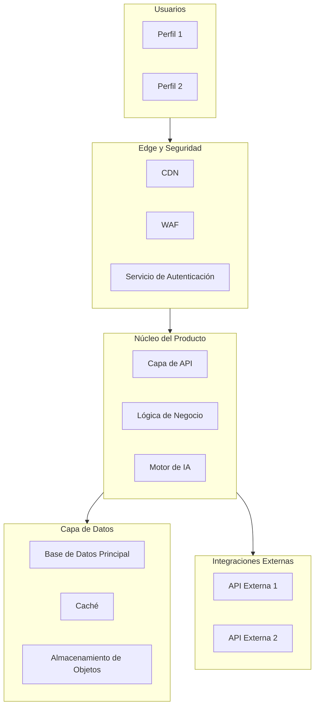

# Detalle del Flujo de Trabajo

Plantillas y guías detalladas para cada artefacto.
Carga este archivo cuando el usuario solicite detalles específicos de generación de artefactos.

---

## Artefacto 1 — Plantilla de Resumen Ejecutivo

```markdown
# Resumen Ejecutivo — [Nombre del Proyecto]

## Problema Identificado
[2-3 párrafos que describan el problema de negocio, no la solución técnica]

## Propuesta de Valor
[Qué resuelve la solución y qué beneficios concretos aporta al cliente]

## Alcance del MVP
### Dentro del alcance
- [Capacidad o funcionalidad 1]
- [Capacidad o funcionalidad 2]

### Fuera del alcance (MVP)
- [Elemento explícitamente excluido 1]
- [Elemento explícitamente excluido 2]

## Supuestos Clave
- [Supuesto 1]
- [Supuesto 2]

## Preguntas y Dudas para el Cliente
| ID | Pregunta | Impacto si no se aclara |
|----|----------|------------------------|
| P1 | ...      | ...                    |
```

---

## Artefacto 6 — Plantilla Mermaid para Arquitectura Contextual


```mermaid
graph TB
  subgraph CLIENTES["Usuarios"]
    direction LR
    U1["Perfil 1"]
    U2["Perfil 2"]
  end

  subgraph EDGE["Edge y Seguridad"]
    CDN["CDN"]
    WAF["WAF"]
    AUTH["Servicio de Autenticación"]
  end

  subgraph NUCLEO["Núcleo del Producto"]
    direction LR
    API["Capa de API"]
    LOGICA["Lógica de Negocio"]
    IA["Motor de IA"]
  end

  subgraph DATOS["Capa de Datos"]
    BD["Base de Datos Principal"]
    CACHE["Caché"]
    ALMACEN["Almacenamiento de Objetos"]
  end

  subgraph EXTERNAS["Integraciones Externas"]
    EXT1["API Externa 1"]
    EXT2["API Externa 2"]
  end

  CLIENTES --> EDGE
  EDGE --> NUCLEO
  NUCLEO --> DATOS
  NUCLEO --> EXTERNAS
```

Adapta los nombres de los servicios al cloud y stack definidos en el Paso 0.
Máximo 3 niveles de anidamiento. Serverless-first para cargas de trabajo variables.

---

## Artefacto 7 — Plantilla de Diagrama de Secuencia

```
sequenceDiagram
  actor Usuario
  participant FE as Frontend
  participant APIGW as API Gateway
  participant SVC as [Nombre del Servicio]
  participant BD as Base de Datos
  participant EXT as Servicio Externo

  Note over Usuario,EXT: ── FLUJO FELIZ ──

  Usuario->>FE: [Acción del usuario]
  FE->>APIGW: [Método HTTP] /[endpoint] {payload}
  APIGW->>SVC: invoke({parámetros})

  alt Ruta exitosa
    SVC->>BD: [Operación de lectura/escritura]
    BD-->>SVC: [Respuesta]
    SVC-->>APIGW: {resultado}
    APIGW-->>FE: 200 OK
    FE-->>Usuario: [Confirmación al usuario]
  else Ruta de error
    SVC-->>APIGW: [Código de error]
    APIGW-->>FE: [Estado de error]
    FE-->>Usuario: [Mensaje de error]
  end
```

---

## Artefacto 9 — Plantilla de Registro de Riesgos

```markdown
## Registro de Riesgos — [Nombre del Proyecto]

| ID  | Riesgo | Categoría | Probabilidad | Impacto | Mitigación Sugerida |
|-----|--------|-----------|--------------|---------|---------------------|
| R01 | Dependencia de API externa sin SLA garantizado | Técnico | Media | Alto | Circuit breaker + caché local |
| R02 | ... | ... | ... | ... | ... |

Categorías: Técnico / Negocio / Regulatorio / Operativo / Equipo
Probabilidad: Alta / Media / Baja
Impacto: Alto / Medio / Bajo
```

---

## Artefacto 10 — Plantilla de ADR

```markdown
## ADR-001 — [Título de la Decisión]

**Fecha:** [Fecha de generación]
**Estado:** Propuesto / Aceptado / Obsoleto

### Contexto
[Por qué fue necesario tomar esta decisión]

### Decisión
[Qué se decidió]

### Alternativas Consideradas
| Alternativa | Ventaja | Desventaja |
|-------------|---------|------------|
| Opción A    | ...     | ...        |
| Opción B    | ...     | ...        |

### Consecuencias
[Qué implica esta decisión a futuro: deuda técnica, restricciones, oportunidades]
```

---

## Artefacto 11 — Plantilla de Estimación de Costos OpEx

```markdown
## Estimación de Costos Operativos — [Nombre del Proyecto]

| Componente | MVP | Escala 1 (10x) | Escala 2 (100x) | Notas |
|------------|-----|----------------|-----------------|-------|
| Cómputo (Lambda/Contenedor) | $X/mes | $Y/mes | $Z/mes | Pago por uso |
| Base de datos | $X/mes | ... | ... | Bajo demanda |
| IA / Tokens | $X/mes | ... | ... | Por consumo |
| CDN / Edge | $X/mes | ... | ... | ... |
| Otros servicios | $X/mes | ... | ... | ... |
| **Total infraestructura** | **$X/mes** | **$Y/mes** | **$Z/mes** | |
| Ingreso estimado (si es SaaS) | $X/mes | $Y/mes | $Z/mes | |
| **Margen operativo** | **X%** | **Y%** | **Z%** | |

Nota: Estimaciones basadas en precios de [Nube] al [Fecha]. Sujeto a variación.
```

---

## Artefacto 13 — Plantilla de Plan de Sprints

```markdown
## Plan de Trabajo por Sprints — [Nombre del Proyecto]

| Sprint | Semanas | Fase          | Entregables Clave | Dependencias |
|--------|---------|---------------|-------------------|--------------|
| S1     | 1-2     | Cimientos     | Infraestructura base, CI/CD, Autenticación | Ninguna |
| S2     | 3-4     | Cimientos     | Modelo multi-tenant, esquema de datos | S1 |
| S3     | 5-6     | Núcleo        | [Funcionalidad principal 1] | S2 |
| S4     | 7-8     | Núcleo        | [Funcionalidad principal 2] | S3 |
| S5     | 9-10    | Inteligencia  | Integración de IA, notificaciones | S4 |
| S6     | 11-12   | Operaciones   | Facturación, portal de administración | S5 |
| S7     | 13-14   | Lanzamiento   | Piloto controlado, ajustes finales, go-live | S6 |
```

---

## Lista de Verificación Anti-Sobreingeniería

Antes de finalizar el Artefacto 6, valida cada decisión:

- [ ] ¿Podría esto ser un servicio administrado en lugar de autoalojado?
- [ ] ¿Es necesaria esta cola en la escala del MVP o una invocación directa es suficiente?
- [ ] ¿Requiere esta base de datos una réplica de lectura desde el MVP?
- [ ] ¿Puede esta lógica vivir en una sola función Lambda en lugar de un microservicio dedicado?
- [ ] ¿Es necesaria esta capa de caché en el MVP o puede agregarse después?

Si alguna respuesta es "no" o "todavía no", simplifica la arquitectura y documenta el camino de escalabilidad como nota.

---

## Artefacto 15 — Plantilla de Modelo de Datos Físico

```markdown
# [Nombre del Proyecto] — Modelo de Datos Físico

> **Motor:** [BD del Paso 0, ej. Oracle ATP 26ai / PostgreSQL 16 / MySQL 8]
> **Decisión arquitectónica de referencia:** ADR-XXX (modelo de persistencia del A10)
> **Versión:** 1.0

## Principios de diseño
- [Principio 1: derivado de los ADRs del A10 y los supuestos del A1]
- [Principio 2: idempotencia, inmutabilidad, retención, etc.]
- [Mínimo 5 principios trazables a artefactos previos]

## Diagrama Entidad-Relación

\`\`\`mermaid
erDiagram
  ENTIDAD_A ||--o{ ENTIDAD_B : relacion
  ENTIDAD_A {
    TIPO campo PK
    TIPO campo
  }
  ENTIDAD_B {
    TIPO campo PK
    TIPO campo FK
  }
\`\`\`

## DDL completo

### Tabla `nombre_tabla`

\`\`\`sql
CREATE TABLE nombre_tabla (
  campo_pk    TIPO        NOT NULL,
  campo_fk    TIPO,
  campo_dato  TIPO        NOT NULL,
  created_at  TIMESTAMP   DEFAULT CURRENT_TIMESTAMP NOT NULL,
  CONSTRAINT pk_nombre_tabla PRIMARY KEY (campo_pk),
  CONSTRAINT fk_nombre_tabla_otra FOREIGN KEY (campo_fk) REFERENCES otra_tabla(id),
  CONSTRAINT ck_nombre_tabla_estado CHECK (estado IN ('VALOR1','VALOR2'))
);

COMMENT ON TABLE nombre_tabla IS 'Descripción funcional de la tabla.';
COMMENT ON COLUMN nombre_tabla.campo_pk IS 'Descripción del campo.';

CREATE INDEX ix_nombre_tabla_campo ON nombre_tabla (campo);
\`\`\`

[Repetir por cada tabla del modelo. Mínimo 5 tablas, máximo razonable según complejidad del dominio.]

## Vistas de soporte (opcional)
[Vistas que sirven directamente al portal o a reportes operativos]

## Estrategia de migraciones
- Herramienta: [Liquibase / Alembic / Flyway según el stack del Paso 0]
- Versionado: scripts incrementales en el repositorio del backend
- Migraciones críticas conocidas: [referencia a riesgos del A9 que impliquen cambios de esquema]

## Estimaciones de tamaño

| Concepto | MVP | Escala 1 (10x) | Escala 2 (100x) |
|---|---|---|---|
| Filas en tabla principal/mes | ... | ... | ... |
| Tamaño promedio por fila | ... | ... | ... |
| Total estimado anual | ... | ... | ... |

## Notas finales
- [Cómo se garantiza cada principio del A1/A2 a nivel de BD]
- [Indicaciones sobre cifrado, backup, particionamiento]
```

**Insumos requeridos del A15:**
- ADRs del A10 que afectan persistencia → reflejados en los principios de diseño
- Procesos del A3 → cada proceso con escritura/lectura debe tener su tabla
- Máquina de estados de las entidades del A3 → CHECK constraints sobre la columna `state`
- Supuestos del A1 sobre retención e idempotencia → constraints UNIQUE, triggers, lifecycle
- RNFs de auditoría y trazabilidad del A2 → tablas de bitácora e historial
- Componentes con dependencia de BD del A6 → confirman qué tablas son consumidas por cada servicio
- Escala del Paso 0 → estimaciones de tamaño y recomendaciones de particionamiento

---

## Artefacto 16 — Plantilla de Historias de Usuario

```markdown
# [Nombre del Proyecto] — Historias de Usuario

> **Formato:** *"Como [rol], quiero [capacidad], para [valor]"*
> **Criterios de aceptación:** estructura **Dado / Cuando / Entonces** en español
> **Versión:** 1.0

## Convenciones
- HU-XXX es el identificador único.
- Mapeo a proceso del A3 cuando aplica.
- Mapeo a sprint del A13.
- Diagrama de origen del A7 y/o pantalla de origen del A8 cuando aplica.
- Componentes del A5/A6 involucrados.
- Sin estimación de story points (las estima el equipo en sprint planning).

# Epic 1 — [Nombre del epic, ej. Cimientos]

## HU-001 — [Título corto y verificable]

**Como** [rol del A3 o del A12],
**quiero** [capacidad funcional concreta],
**para** [valor de negocio o técnico que aporta].

**Mapeo a proceso A3:** P-XX
**Mapeo a sprint A13:** Sprint N
**Diagrama de origen:** seq_NN_[nombre] (si aplica)
**Pantalla de origen:** Pantalla N — [nombre] (si aplica)
**Componentes involucrados:** [N1, N2, D1, X1...]

**Criterios de aceptación:**

- **Dado** [contexto inicial], **cuando** [acción específica], **entonces** [resultado verificable].
- **Dado** [otro contexto], **cuando** [acción], **entonces** [resultado].
- [Mínimo 3 criterios, preferentemente 5-7 para historias complejas]

[Repetir por cada historia del epic]

# Epic 2 — [...]

[...]

# Resumen del backlog

## Distribución por epic
| Epic | Historias | Sprint(s) |
|---|---|---|
| Epic 1 | HU-001 a HU-XXX | Sprint N |
| ... | ... | ... |

## Distribución por rol
[Tabla con cuántas historias tiene cada rol como protagonista]

## Cobertura de procesos del A3
[Verificar que todos los procesos del A3 estén cubiertos por al menos una historia, salvo los de soporte]

## Notas para el backlog refinement
- Historias críticas para arrancar
- Historias bloqueadas por preguntas abiertas del A1
- Historias dependientes de respuestas del cliente
```

**Insumos requeridos del A16:**
- Procesos del A3 → cada proceso debe estar cubierto por al menos una historia
- Pantallas del A8 → cada pantalla genera al menos una historia de uso
- Diagramas de secuencia del A7 → cada seq_NN se referencia en la historia que lo materializa
- Roles del A12 → fuente de los protagonistas de las historias
- Sprints del A13 → mapeo explícito de cuándo se entrega cada historia
- Riesgos del A9 → historias bloqueadas por riesgos críticos quedan marcadas
- Preguntas abiertas del A1 → historias dependientes de respuestas del cliente quedan señaladas
- ADRs del A10 → cuando una decisión arquitectónica tiene impacto en una historia (ej. "API Keys M2M" en la historia de webhook), se referencia
